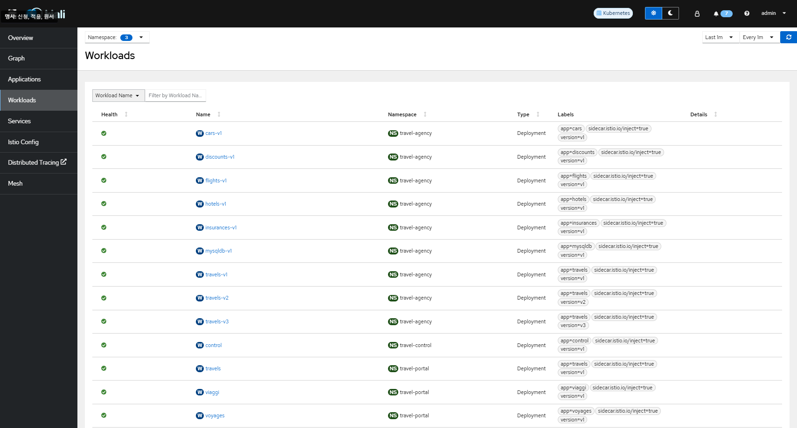
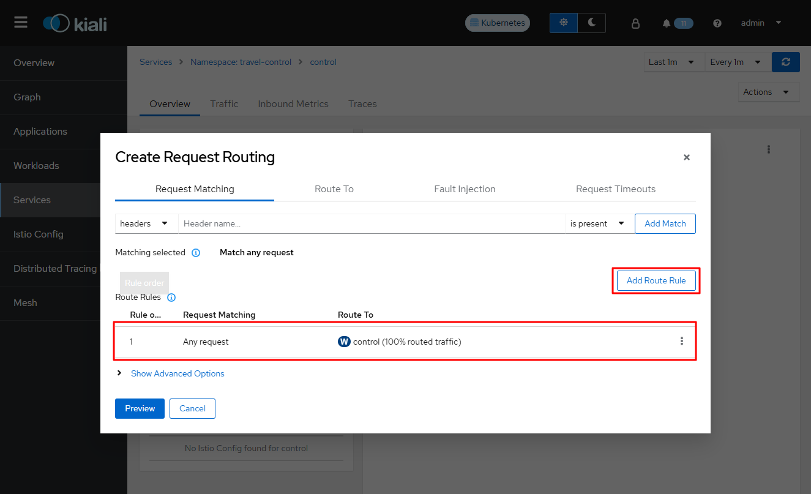
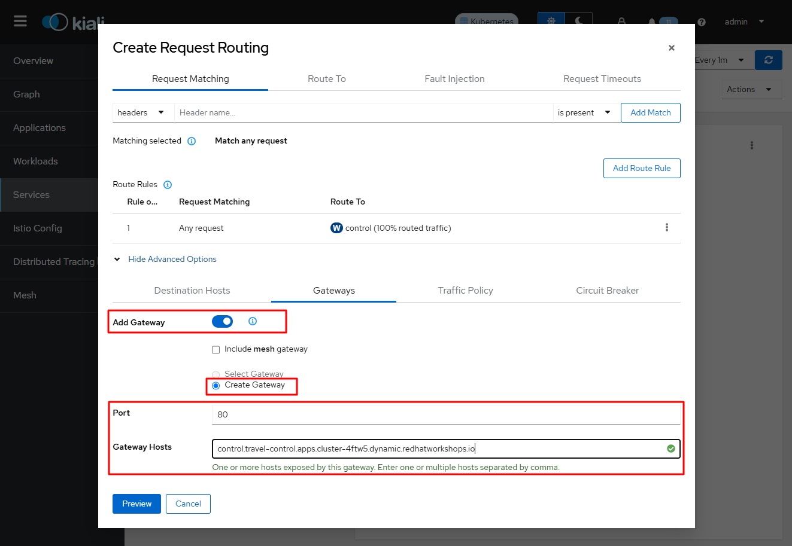
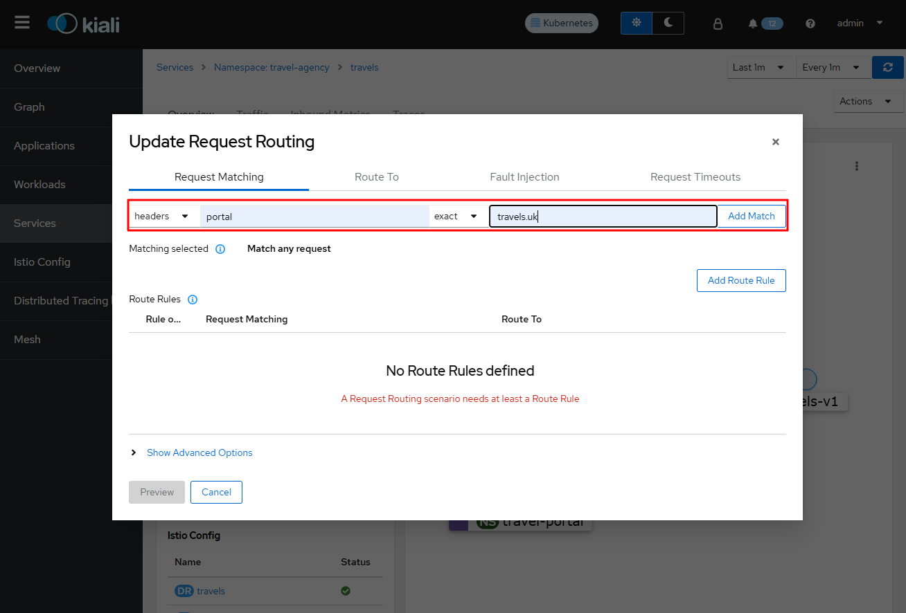
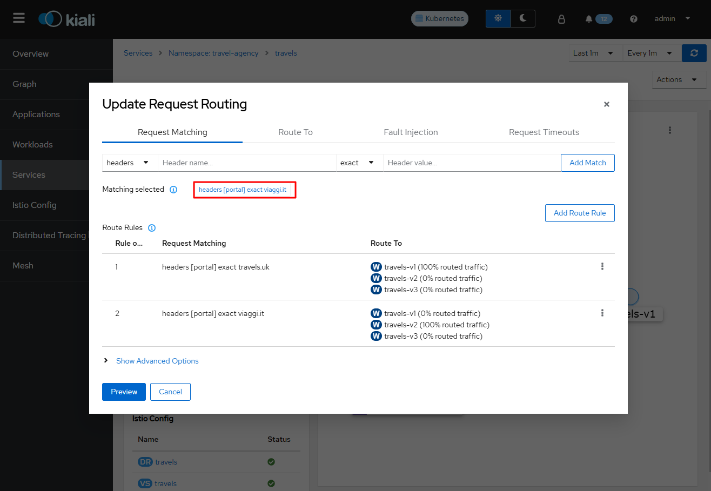
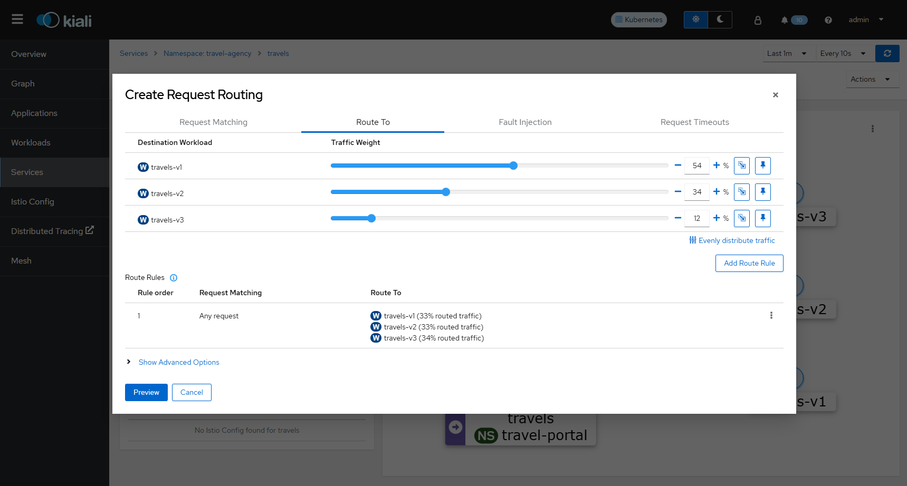

## Service Mesh 배포

### 1. Operator Overview

Red Hat OpenShift Service Mesh에는 다음과 같은 네 가지 Operator가 필요합니다.

- **OpenShift Elasticsearch** - (Optional)은 Jaeger를 사용하여 추적 및 로깅할 수 있는 데이터베이스 스토리지를 제공합니다. 오픈소스 Elasticsearch 프로젝트를 기반으로 합니다.

- **Jaeger(Red Hat OpenShift distributed tracing platform)** - 복잡한 분산 시스템의 트랜잭션을 모니터링하고 문제를 해결하기 위해 추적기능을 제공합니다. 오픈소스 Jaeger 프로젝트를 기반으로 합니다.

- **Kiali** - Service Mesh에 대한 가시성을 제공합니다. 단일 콘솔에서 구성을 보고, 트래픽을 모니터링하며 추적을 분석할 수 있습니다. 오픈소스 Kiali 프로젝트를 기반으로 합니다.

  설치 시 **Stable** 버전으로 선택할 것!! 예제에서는 **1.89.8** 버전을 선택하여 설치하였습니다.

- **Red Hat OpenShift Service Mesh 2.6.x** - 애플리케이션을 구성하는 마이크로 서비스를 연결, 보안, 제어 및 관찰할 수 있습니다. Service Mesh Operator는 Service Mesh 구성 요소의 배포, 업데이트 및 삭제를 관리하는 `ServiceMeshControlPlane` 리소스를 정의하고 모니터링합니다. 오픈소스 Istio 프로젝트를 기반으로 합니다.

**1-1) Installing the Operators**

Red Hat OpenShift Service Mesh를 설치하려면 다음 Operator를 이 순서대로 설치합니다. 각 Operator에 대한 절차를 반복합니다.

- (Optional) Elasticsearch

- Jager (Red Hat OpenShift distributed tracing platform)

- Kiali

- Red Hat OpenShift Service Mesh

   <br>

**1-2) Creating the ServiceMeshControlPlane**

- Deploying the control plane from the web console

  웹 콘솔을 사용하여 `ServiceMeshControlPlane`을 배포할 수 있습니다.

  1. 콘솔 로그인

  2. `istio-system` 프로젝트 생성

  3. Operators -> 설치된 Operator로 이동

  4. Red Hat OpenShift Service Mesh Operator를 클릭한 다음 Istio Service Mesh Control Plane을 클릭

  5. Istio Service Mesh Control Plane 탭에서 ServiceMeshControlPlane 생성을 클릭

  6. ServiceMeshControlPlane 생성 페이지에서 기본 컨트롤 플레인 버전을 수락하여 제품의 최신 버전에서 사용할 수 있는 기능을 활용합니다. 컨트롤 플레인의 버전에 따라 Operator 버전에 관계없이 사용 가능한 기능이 결정됩니다.
     
     - 생성을 클릭합니다. Operator는 구성 매개변수를 기반으로 pods, 서비스 및 Service Mesh Control Plane 구성 요소를 생성합니다.
     
     - 생성 시 istio-proxy의 access_log 설정을 하기 위해서는 리소스에 다음 내용을 추가하여 설정합니다.
     
       - Console 설정 예시
       
         - Proxy > Access Logging > File > Name > `/dev/stdout` 입력
            <br>
         
         - 전체 설정 예시
       
           ```yaml
           apiVersion: maistra.io/v2
           kind: ServiceMeshControlPlane
           metadata:
             name: basic
             namespace: istio-system
           spec:
             addons:
               grafana:
                 enabled: true
               jaeger:
                 install:
                   storage:
                     type: Memory
               kiali:
                 enabled: true
               prometheus:
                 enabled: true
             gateways:
               openshiftRoute:
                 enabled: true
             policy:
               type: Istiod
             profiles:
               - default
             proxy:
               accessLogging:
                 file:
                   name: /dev/stdout
             telemetry:
               type: Istiod
             tracing:
               sampling: 10000
             type: Jaeger
             version: v2.6
           ```
     
  7. 컨트롤 플레인이 올바르게 설치되었는지 확인하려면 Istio Service Mesh Control Plane 탭을 클릭합니다.
      <br>

**1-3) Creating the Red Hat OpenShift Service Mesh member roll**

`ServiceMeshMemberRoll`은 컨트롤 플레인에 속하는 프로젝트를 나열합니다. `ServiceMeshMemberRoll`에 나열된 프로젝트만 컨트롤 플레인의영향을 받습니다. 특정 컨트롤 플레인 배포의 멤버 롤에 추가할 때까지 프로젝트는 서비스 메시에 속하지 않습니다.

`ServiceMeshControlPlane`과 동일한 프로젝트에서 `defalut`라는 `ServiceMeshMemberRoll` 리소스를 생성해야 합니다. 

- Creating the memeber roll from the web console
  1. 콘솔 로그인
  2. 메시에 대한 서비스가 없거나 처음부터 시작하는 경우 프로젝트를 생성합니다. `istio-system`과 다른 프로젝트여야 합니다.
  3. Operators -> 설치된 Operator로 이동
     1. 프로젝트 메뉴를 클릭하고 `ServiceMeshControlPlane` 리소스가 목록에서 배포되는 프로젝트를 선택 (ex: `istio-system`)
     2. Red Hat OpenShift Service Mesh Operator를 클릭
     3. Istio Service Mesh 멤버 롤 탭을 클릭
     4. ServiceMeshMemberRoll 생성을 클릭
     5. Members(구성원)을 클릭한 다음 Values(값) 필드에 프로젝트 이름을 입력. 여러 프로젝트를 추가할 수 있지만 프로젝트는 하나의 `ServiceMemberRoll` 리소스에만 속할 수 있습니다.
     6. 생성을 클릭

- Sample 설정

  ```yaml
  apiVersion: maistra.io/v1
  kind: ServiceMeshMemberRoll
  metadata:
    namespace: istio-system
    name: default
  spec:
    members:
      - travel-agency
      - travel-portal
      - travel-control
  ```


### 2. Travels Demo 배포 (사전 준비 사항)

**2-1) 네임스페이스 생성**

```bash
oc new-project travel-agency
oc new-project travel-portal
oc new-project travel-control
```

- **Service Mesh Member Roll 적용 확인**

  해당 설정은 프로젝트가 생성되어야 적용이 확인 됩니다.

  ```bash
  [root@bastion ~]# oc get smmr -n istio-system
  NAME      READY   STATUS       AGE
  default   3/3     Configured   3m39s
  ```

  또는 콘솔에서 확인 할 수 있습니다.
   <br>

**2-2) 애플리케이션 배포**

```bash
oc apply -f <(curl -L https://raw.githubusercontent.com/kiali/demos/master/travels/travel_agency.yaml) -n travel-agency
oc apply -f <(curl -L https://raw.githubusercontent.com/kiali/demos/master/travels/travel_portal.yaml) -n travel-portal
oc apply -f <(curl -L https://raw.githubusercontent.com/kiali/demos/master/travels/travel_control.yaml) -n travel-control
```

**2-3) travels-v2, travles-v3 애플리케이션 배포**

```bash
oc apply -f <(curl -L https://raw.githubusercontent.com/kiali/demos/master/travels/travels-v2.yaml) -n travel-agency
oc apply -f <(curl -L https://raw.githubusercontent.com/kiali/demos/master/travels/travels-v3.yaml) -n travel-agency
```

**2-4) Kiali Console 접속**

Servicve Mesh Control Plane이 설치된 `istio-system` 프로젝트를 선택하면, 오른쪽 옆에 Kiali, Jaeger를 실행할 수 있는 링크가 확인됩니다. 이를 통해서도 접속이 가능합니다.

 <br>

**2-5) 사이드 카 인젝션 적용**

Kiali 대시 보드 접속 ->  Workloads -> 각 각의 Workloads 선택 -> 오른쪽 끝에 Actions -> Enable Auto InJection 클릭

 <br>

- 예시)

  하나의 서비스를 예로 적용해본다면, cars-v1 선택 > Actions > Enable Auto Injection 선택 > 해당 설정이 반영 되면서 Pod가 재기동 됩니다.

   <br>

  반영이 된 이후에는 Details에서 Missing Sidecar 메시지가 사라진 것을 볼 수 있습니다.

   <br>

  해당 서비스의 Deployment를 확인해보면 다음과 같이 `sidecar.istio.io/inject: true` 가 labels로 추가된 것을 확인할 수 있습니다.

   <br>

**2-6) ingressgateway를 통한 route 생성**

- Kiali Console 접속

  - Namespace : **travel-control** 선택 > Services > control 선택 > Actions > Request Routing 선택
     <br>
  
  - Add Route Rule 생성 
     <br>
  
  - Show Advanced Options를 선택하여 Gateway를 생성합니다.
  
    - Add Gateway 활성화 > Create Gateway > Port 확인 > Gateway Hosts 입력
  
      - Gateway Hosts : `control.travel-control.apps.${CLUSTER_BASE_DOMAIN}`
         <br>
  
  - 서비스 호출
  
    `istio-system` 네임스페이스의 Networking > Routte를 확인해보면, travel-control Route 주소가 생성된 것을 볼 수 있습니다. 이를 통해 서비스 접속을 확인할 수 있습니다. 페이지가 정상적으로 호출될 경우 아래 화면과 같이 페이지가 보입니다.
     <br>

### 3. 서비스메시 구성요소 설명

**3-1) Kiali, Jager 등 구성요소 간단 설명**

- Kiali : Service Mesh에 대한 가시성을 제공합니다. 단일 콘솔에서 구성을 보고, 트래픽을 모니터링하며 추적을 분석할 수 있습니다. 오픈소스 Kiali 프로젝트를 기반으로 합니다.
- Jaeger : 복잡한 분산 시스템의 트랜잭션을 모니터링하고 문제를 해결하기 위해 추적기능을 제공합니다. 오픈소스 Jaeger 프로젝트를 기반으로 합니다.
- Red Hat OpenShift Service Mesh : 애플리케이션을 구성하는 마이크로 서비스를 연결, 보안, 제어 및 관찰할 수 있습니다. Service Mesh Operator는 Service Mesh 구성 요소의 배포, 업데이트 및 삭제를 관리하는 `ServiceMeshControlPlane` 리소스를 정의하고 모니터링합니다. 오픈소스 istio 프로젝트를 기반으로 합니다.
- OpenShift Elasticsearch (Optional) : Jaeger를 사용하여 추적 및 로깅할 수 있는 데이터베이스 스토리지를 제공합니다. 오픈소스 Elasticsearch 프로젝트를 기반으로 합니다.

**3-2) 서비스메시 관리 콘솔 기능 시연**

간단하게 설명 및 시연

**3-3) MSA 애플리케이션 서비스 흐름 추적 관찰**
 <br>

- Display에서 Traffic Animation을 선택하면 실시간으로 트래픽의 흐름을 볼 수 있습니다.
   <br>

### 4. 트래픽 관리

**4-1) Matching Rule에 의한 Request Routing**

Portal 워크로드는 HTTP/1.1 프로토콜을 사용하여 여행 서비스를 호출하므로 한 가지 전략은 HTTP 헤더를 사용하여 일치 조건을 정의하는 것일 수 있습니다.

라우팅 규칙에서 각각의 버전에 특정 헤더 값과 동일한 경우 해당 버전으로 라우팅 시키는 규칙을 추가 할 수 있습니다.

Kiali 접속 -> 서비스 선택 -> travel agency 네임스페이스 선택 -> travels 선택 -> 오른쪽 끝에 Request Routing 선택 

- 첫 번째 규칙 : Request Matching 선택

  headers -> portal / exact -> travels.uk 입력 -> Add Match 선택
   <br>

  Route To -> travels-v1 100% 
   <br>

- 두번째 규칙 : Request Matching 선택

  headers -> portal / exact -> viaggi.it 입력 -> Add Match 선택 > 선택된 Matching에 viaggi.it만 선택되어야 합니다. 다른 Matching은 클릭하여 선택을 해제합니다. 
   <br>
  Route To -> travels-v2 100%
   <br>

- 세번째 규칙 : Request Matching 선택

  headers -> portal / exact -> voyages.fr 입력 -> Add Match 선택 > 선택된 Matching에 voyages.fr만 선택되어야 합니다. 다른 Matching은 클릭하여 선택을 해제합니다.
   <br>
  
  Route To -> travels-v3 100%
   <br>

전체 생성된 규칙을 확인하고, Preview 버튼을 선택합니다.
 <br>

Update 버튼을 선택하여 반영합니다.
 <br>

Workloads -> 네임스페이스 : travel agency 선택 -> travels-v2 선택 -> Inbound Metrics 선택하면 유사한 패턴 확인 할 수 있음
 <br>

**4-2) Traffic 가중치에 의한 Routing Rule 생성**

생성하기 전에 위에서 생성한 Traffic Routing은 삭제하고 진행합니다.
 <br>

Kiali 접속-> 서비스 선택 -> travel-agency 네임스페이스 선택 -> travels 선택 -> 오른쪽 끝에 Actions -> Request Routing 선택 -> Add Route Rule 생성
 <br>

> 기본적으로 33%, 33%, 33%로 Route Rule이 생성됩니다. 

비율을 변경하기 위해서는 Route To를 선택하여 비율을 조정할 수 있습니다. 설정을 한 후에는 Preview > Create 버튼을 눌러서 설정을 반영합니다.
 <br>

### 5. Fault Injection (장애주입)

Fault Injection 시나리오를 수행하기 위해서는 필요에 따라서 istio 구성은 수정되거나 삭제 됩니다.

시나리오에서는 호텔 서비스에 장애를 주입하여 어떻게 반응하는지 관찰하여 Travels Demo 애플리케이션의 복원력을 테스트하는 방법을 보여드리겠습니다.

**5-1) Fault Injection 주입**

HTTP 요청의 10%를 취소하여 503 에러를 리턴하도록 설정하여 이를 로깅/트레이싱으로 확인합니다. 

Travel-Agency의 호텔 서비스에 503에러가 10% 발생하도록 오류를 주입합니다.

특정 서비스에 장애가 발생해도 다른 서비스에 장애가 전파되지 않음을 확인 할 수 있습니다.

- 설정 방법

Kiali 접속 -> 서비스 -> 네임스페이스 : travel-agency 선택 -> hotels 선택 -> 오른쪽 끝에 기존 Delete Traffic Routing -> Fault Injection 선택

> Delete Traffic Routing이 활성화 되지 않은 경우에는 Request Routing을 선택하여 Fault Injection을 주입합니다.

Add HTTP Abort 설정 > Delay Percentage : 10 > HTTP Status Code > 503 > 생성
 <br>

그래프에서 travels 서비스에서 hotels 서비스로 가는 Request에서 503 에러가 발생됨을 추적할 수 있습니다.
 <br>

에러가 발생한 travels-v1을 선택하여 Details 확인후, 로그에서 에러를 추적합니다. 해당 로그에서 503을 입력하여 검색하면, hotels 서비스에서 503에러가 발생된 것을 확인 할 수 있습니다.
 <br>

Traces 항목에서도 Spans Details를 통해 에러 확인이 가능합니다.
 <br>

### 6. Circuit Breakers

Circuit Breakers는 장애, 대기 시간 급증 및 기타 유형의 네트워크 문제의 영향을 제한하는 데 사용되는 중요한 기술입니다. 이번 시나리오에서는 동시 요청 및 연결 수를 제한하기 위해 여행 서비스에 Circuit Breaker를 적용해 보도록 하겠습니다.

특정 부하사항을 대비하여 장애가 발생했을 때 장애가 더 전파되기 전에 사전에 Circuit Breaker를 통해 조치할 수 있습니다.

**6-1) travel_loadtester 배포**

시스템 부하의 중요한 증가를 시뮬레이션하는 새 워크로드를 배포합니다.

```bash
oc apply -f <(curl -L https://raw.githubusercontent.com/kiali/demos/master/travels/travel_loadtester.yaml) -n travel-portal
```

loadtester의 작업 부하는 50개 동시 연결을 만들려고 합니다. 
 <br>

- travles Inbound Metrics

  처음에는 비정상적인 상태가 표시되지 않습니다.
   <br>

**6-2) Traffic Shifting으로 travles 서비스에 Circuit Breakers 설정 주입**

기존 Routing 설정이 있는 경우 삭제하고 Traffic Shifting 설정을 적용합니다. 적용이 반영되기 전까지는 이전 설정으로 서비스 됩니다.

- Routing 삭제
   <br>

- Traffic Shifting 생성

  Traffic Shifting 버튼을 선택하여 Circuit Breaker 설정을 주입합니다. Preview 버튼을 누르고 Create를 눌러서 설정을 반영합니다.
   <br>

  > Connection Pool 설정은 동시 연결 및 요청 수가 둘 이상인 경우 프록시 사이드카가 요청을 거부함을 나타냅니다.
  >
  > 연속 오류 두 개가 있는 경우 "이상값 감지"는 Connection Pool에서 호스트를 제거합니다.

Graph -> 네임스페이스 -> travel-agency -> loadtester 선택 -> Flag를 확인하여 요청이 Circuit Breaker에 의해 차단 되었는지 확인 가능
 <br>

`loadtester` Versioned-app Graph에서 travels 서비스의 Circuit Breaker가 일부 연결을 허용하지만 대부분은 실패하는 연결을  볼 수 있습니다. 이러한 연결은 `loadtester`의 proxy에 의해 중지됩니다. "빨리 실패" 패턴은 네트워크 과부하를 방지합니다. 그래프에서 실패한 Edge를 선택하여  Flag 탭을 확인하면 해당 요청이 Circuit Breaker에 의해 차단되었는지 확인할 수 있습니다.

Workloads -> 네임스페이스 : travel-agency -> loadtester -> Outbound Metrics 선택 -> 요청 볼륨이 줄어든 것을 볼 수 있음
 <br>


참고 URL)

https://kiali.io/docs/tutorials/travels/

https://github.com/kiali/demos

https://github.com/justone0127/test-travel.git 
